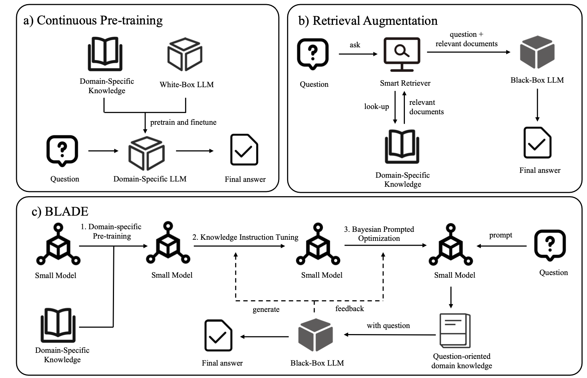

# BLADE: Enhancing Black-box Large Language Models with Small Domain-Specific Models

**BLADE** is a novel framework that bridges the gap between general-purpose Large Language Models (LLMs) and domain-specific tasks by integrating a small, domain-specific language model (LM). This approach enhances performance on specialized datasets without requiring access to or fine-tuning of black-box LLMs.


---

## 🌟 Key Features

- **Black-box Friendly**: Leverages general LLMs like GPT-4 as-is, with no need for parameter tuning.
- **Domain-Specific Knowledge**: Uses a small LM pre-trained on domain-specific data to provide precise insights.
- **Cost-Efficient**: Avoids the high computational and financial costs of re-training large models.
- **Modular Design**: Combines the strengths of general LLMs and specialized domain-specific LMs for robust performance.

---

## 🛠️ Methodology

BLADE employs a three-step process:

1. **Domain-specific Pretraining (DP)**: Trains the small LM on domain-specific corpora to embed specialized knowledge.
2. **Knowledge Instruction Tuning (KIT)**: Refines the small LM using pseudo-labeled data generated by general LLMs.
3. **Bayesian Prompted Optimization (BPO)**: Optimizes interaction between the small LM and the general LLM for task-specific performance.

---





## 🚀 How to Use

### Installation
Clone the repository and install dependencies:
```bash
git clone https://github.com/your-repo/blade.git
cd blade
pip install -r requirements.txt
```

## 🚀 Training


Follow these steps to implement BLADE.

### 1. Pretrain the Small LM
During the Pretrain and Knowledge Tuning stages, we use [LLaMA-Factory](https://github.com/hiyouga/LLaMA-Factory).


Run the following command to pretrain the small language model on domain-specific data:
```bash
CUDA_VISIBLE_DEVICES=0,1,2 llamafactory-cli train \
    --stage pt \
    --model_name_or_path model_path \
    --do_train \
    --dataset dataset_path \
    --finetuning_type full \
    --output_dir output_path \
    --overwrite_cache \
    --per_device_train_batch_size 4 \
    --gradient_accumulation_steps 8 \
    --lr_scheduler_type cosine \
    --logging_steps 10 \
    --save_steps 5000 \
    --learning_rate 5e-6 \
    --num_train_epochs 10.0 \
    --plot_loss 
```

Given the recent advancements in small model capabilities, we recommend further using Qwen-2.5-0.5B and Qwen-2.5-1.5B as the base models for the small model.


### 2. Knowledge Instruction Tuning

```bash
CUDA_VISIBLE_DEVICES=${TOT_CUDA} llamafactory-cli train \
    --stage sft \
    --model_name_or_path model_path \
    --do_train \
    --dataset data_path \
    --finetuning_type full \
    --prompt_template alpaca \
    --output_dir output_path \
    --overwrite_cache \
    --per_device_train_batch_size 4 \
    --gradient_accumulation_steps 4 \
    --lr_scheduler_type cosine \
    --logging_steps 20 \
    --save_strategy epoch \
    --learning_rate 5e-5 \
    --num_train_epochs 10.0 \
    --plot_loss \
    --deepspeed ds_config.json 
```

We have recently provided the knowledge tuning data for JEC-QA using Qwen-2.5-72B-Instruct in the /data directory. The related code can be found in /src/generate_knowledge.py. The related data will be open-sourced soon.


### 3. Bayesian Prompted Optimization

Optimize the interaction between the small LM and the general LLM:

```bash
python /src/BPO/run_instructzero.py
```

This code provides an example of BPO optimization. When optimizing for specific large and small models, you can modify the prompts as needed based on the actual scenario.

### 🧪 Inference
We provide code for inference with soft tokens.


```bash
python src/eval_with_soft.py
```

## 🔗 Citation
If you find this work helpful, please cite the paper:

```
@misc{li2024bladeenhancingblackboxlarge,
      title={BLADE: Enhancing Black-box Large Language Models with Small Domain-Specific Models}, 
      author={Haitao Li and Qingyao Ai and Jia Chen and Qian Dong and Zhijing Wu and Yiqun Liu and Chong Chen and Qi Tian},
      year={2024},
      eprint={2403.18365},
      archivePrefix={arXiv},
      primaryClass={cs.CL},
      url={https://arxiv.org/abs/2403.18365}, 
}
```